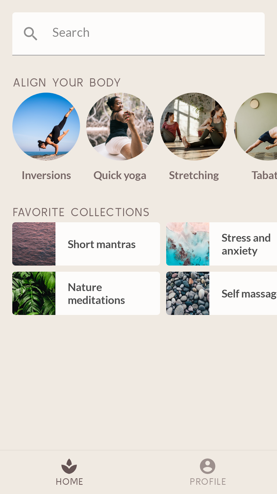

#MySoothe

##about
MySoothe is a well-being app that lists various ways to improve your body and mind. It contains a
section that lists your favorite collections, and a section with physical exercises. This is what
the app looks like:

##Screenshot

## While implement a realistic app design, I learnt about:

  -  How modifiers help you augment your composables.
  -  How standard layout components like Column and LazyRow position child composables.
  -  How alignments and arrangements change the position of child composables in their parent.
  -  How Material composables like Scaffold and Bottom Navigation help you create comprehensive layouts.
  -  How to build flexible composables using slot APIs.
